# Design Document — Velora OOP Implementation

## Overview

This document describes the technical design for applying the four OOP pillars — Inheritance, Abstraction, Interfaces, and Polymorphism — across all 11 domain modules of the Velora platform. Velora is a multi-tenant SaaS commerce platform built on Clean Architecture and Domain-Driven Design (DDD).

The refactoring is organized into four sequential phases that mirror the task list in `docs/progress-update/tasks.md`:

- **Phase 1 — Inheritance (INH-01 through INH-17):** Introduce shared abstract base classes to eliminate duplicate fields and methods across domain entities and services.
- **Phase 2 — Abstraction (ABS-01 through ABS-07):** Introduce abstract classes with template methods to enforce consistent behavioral contracts.
- **Phase 3 — Interface (INT-01 through INT-23):** Define repository, gateway, and service contracts so the domain depends only on abstractions.
- **Phase 4 — Polymorphism (POLY-01 through POLY-08):** Introduce pluggable strategy interfaces so behavior can vary at runtime without modifying orchestrators.

The goal is to eliminate code duplication, enforce domain invariants at the type level, and enable extensible behavior through a structured hierarchy.


## Architecture

Velora follows Clean Architecture with three layers:

```
┌─────────────────────────────────────────────────────────────┐
│                    DOMAIN LAYER                             │
│  Entities · Abstract Bases · Domain Services · Repositories │
├─────────────────────────────────────────────────────────────┤
│                  APPLICATION LAYER (core.service)           │
│         IService interfaces · Service implementations       │
├─────────────────────────────────────────────────────────────┤
│                 INFRASTRUCTURE LAYER                        │
│    PostgresXxx implementations · EmailGateway impl         │
└─────────────────────────────────────────────────────────────┘
```

The dependency rule is strictly enforced: domain depends on nothing outside itself; application layer depends on domain interfaces; infrastructure implements domain interfaces.

### Package Structure

```
com.velora.app.common
  AbstractEntity
  AbstractAuditableEntity
  AbstractSubscriptionAccount
  AbstractSubscriptionRecord
  AbstractSnapshot
  AbstractDomainService
  AbstractAccessPolicy
  AbstractSnapshotAggregator<T>
  AbstractReportPeriod
  AbstractDiscountCalculator
  AbstractNotificationDispatcher
  DomainException

com.velora.app.core.domain.{domain}
  Domain entities, repository interfaces, domain services, access policies

com.velora.app.core.service
  IService interfaces and implementations per subdomain

com.velora.app.infrastructure.db
  PostgresXxx repository implementations
```


## Components and Interfaces

### Phase 1 — Inheritance

#### INH-01: AbstractEntity

The root of the entity hierarchy. Provides UUID-based identity, equality, and a canonical `toString`.

```java
// com.velora.app.common.AbstractEntity
public abstract class AbstractEntity {
    private final UUID id;

    protected AbstractEntity(UUID id) {
        if (id == null) throw new DomainException("id must not be null");
        this.id = id;
    }

    public UUID getId() { return id; }

    @Override
    public boolean equals(Object o) { ... /* based solely on id */ }

    @Override
    public int hashCode() { return Objects.hash(id); }

    @Override
    public String toString() {
        return getClass().getSimpleName() + "{id=" + id + "}";
    }
}
```

**Design decision:** Equality is identity-based (UUID), not value-based. This matches DDD aggregate semantics where two objects with the same id are the same entity regardless of field values.

---

#### INH-02: AbstractAuditableEntity

Extends `AbstractEntity` with immutable `createdAt` and mutable `updatedAt` managed via `touch()`.

```java
// com.velora.app.common.AbstractAuditableEntity
public abstract class AbstractAuditableEntity extends AbstractEntity {
    private final LocalDateTime createdAt;
    private LocalDateTime updatedAt;

    protected AbstractAuditableEntity(UUID id) {
        super(id);
        this.createdAt = LocalDateTime.now();
        this.updatedAt = this.createdAt;
    }

    protected void touch() { this.updatedAt = LocalDateTime.now(); }

    public LocalDateTime getCreatedAt() { return createdAt; }
    public LocalDateTime getUpdatedAt() { return updatedAt; }
}
```

**Design decision:** `touch()` is `protected` so only subclasses can call it from mutation methods, preventing external callers from bypassing the audit trail.

---

#### INH-03 through INH-09: Entity Inheritance Application

All domain entities extend the appropriate base class and remove duplicate fields:

| Entity | Base Class | touch() call sites |
|---|---|---|
| User | AbstractAuditableEntity | — |
| UserAuth | AbstractAuditableEntity | — |
| Membership | AbstractAuditableEntity | any update method |
| Role | AbstractEntity | — |
| Shop | AbstractAuditableEntity | transitionStatus(), updateAddress() |
| Product, ProductVariant, Category, EventType | AbstractAuditableEntity | any mutation |
| EventProduct | AbstractAuditableEntity | status transitions |
| Order, OrderItem, Receipt, Delivery, PaymentIntent | AbstractAuditableEntity | — |
| Transaction, Invoice, PaymentMethod | AbstractAuditableEntity | — |
| Notification, NotificationPreferences, NotificationDispatchRecord | AbstractAuditableEntity | — |
| FeatureSuggestion | AbstractAuditableEntity | edit(), updateStatus() |

---

#### INH-10 through INH-11: AbstractSubscriptionAccount

Shared lifecycle base for `UserAccount` and `ShopAccount`.

```java
// com.velora.app.common.AbstractSubscriptionAccount
public abstract class AbstractSubscriptionAccount {
    protected UUID subscriptionId;
    protected UUID planId;
    protected UUID registryId;
    protected AccountStatus status;
    protected LocalDate startDate;
    protected LocalDate endDate;
    protected LocalDate refundDeadline;
    protected int currentPlanDurationMonths;

    protected LocalDate calculateEndDate(LocalDate start, int months) {
        return start.plusMonths(months);
    }

    protected LocalDate calculateRefundDeadline(LocalDate start) {
        return start.plusDays(14); // 14-day refund window per Domain.md
    }

    public void markExpiredIfNeeded() {
        if (endDate != null && endDate.isBefore(LocalDate.now()) && status == AccountStatus.ACTIVE) {
            this.status = AccountStatus.EXPIRED;
        }
    }

    public abstract boolean isActive();
    public abstract void activatePlan(SubscriptionPlan plan);
    public abstract void cancel();
}
```

**Design decision:** `calculateRefundDeadline` uses 14 days to match the invariant in `Domain.md` (`refundDeadline = startDate + 14 days`).

---

#### INH-12 through INH-13: AbstractSubscriptionRecord

Shared record base for `UserSubscription` and `ShopSubscription`.

```java
// com.velora.app.common.AbstractSubscriptionRecord
public abstract class AbstractSubscriptionRecord {
    protected UUID subscriptionId;
    protected UUID transactionId;
    protected UUID planId;
    protected SubscriptionStatus status;
    protected LocalDate startDate;
    protected LocalDate endDate;
    protected LocalDate refundDeadline;

    public void markRefunded() {
        this.status = SubscriptionStatus.REFUNDED;
    }
}
```

---

#### INH-14 through INH-15: AbstractSnapshot

Immutable base for all analytics snapshot entities. All fields are write-once.

```java
// com.velora.app.common.AbstractSnapshot
public abstract class AbstractSnapshot {
    private final UUID snapshotId;
    private final LocalDate snapshotDate;
    private final UUID shopId;
    private final LocalDateTime createdAt;

    protected AbstractSnapshot(UUID snapshotId, LocalDate snapshotDate, UUID shopId) {
        this.snapshotId = snapshotId;
        this.snapshotDate = snapshotDate;
        this.shopId = shopId;
        this.createdAt = LocalDateTime.now();
    }
    // getters only, no setters
}
```

---

#### INH-16 through INH-17: AbstractDomainService

Shared guard methods for domain services.

```java
// com.velora.app.common.AbstractDomainService
public abstract class AbstractDomainService {
    protected void requireRole(Role.RoleName actual, Role.RoleName... allowed) {
        for (Role.RoleName r : allowed) {
            if (r == actual) return;
        }
        throw new DomainException("Role " + actual + " is not authorized for this operation");
    }

    protected void requireNotNull(Object value, String fieldName) {
        if (value == null) throw new DomainException(fieldName + " must not be null");
    }
}
```

Extends: `NotificationService`, `FeedbackService`, `ReportingService`, `AnalyticsAggregationService`.


### Phase 2 — Abstraction

#### ABS-01 through ABS-02: AbstractAccessPolicy

Abstract base for all role-based access policies. Provides a concrete `requireAdmin` that delegates to the abstract `check`.

```java
// com.velora.app.common.AbstractAccessPolicy
public abstract class AbstractAccessPolicy {
    public abstract void check(Role.RoleName actorRole, String operation);

    public void requireAdmin(Role.RoleName actorRole) {
        check(actorRole, "ADMIN_ONLY");
    }
}
```

Subclasses: `NotificationAccessPolicy`, `FeedbackAccessPolicy`, `RolePolicy` (inventory), `AnalyticsAccessPolicy`.

---

#### ABS-03: AbstractSubscriptionAccount Lifecycle Abstraction

`activatePlan(SubscriptionPlan)` and `cancel()` are declared abstract in `AbstractSubscriptionAccount` (added in this phase). Each subclass provides domain-specific logic:

- `UserAccount.activatePlan()` — sets user-specific fields, calls `calculateEndDate()`, sets `refundDeadline` via `calculateRefundDeadline()`
- `ShopAccount.activatePlan()` — same pattern with shop-specific fields and `autoRenew` handling
- Both implement `cancel()` with their own cancellation state transitions

---

#### ABS-04: AbstractSnapshotAggregator (Template Method)

```java
// com.velora.app.common.AbstractSnapshotAggregator<T>
public abstract class AbstractSnapshotAggregator<T> {
    public abstract T aggregate(UUID shopId, LocalDate date);
    public abstract void persist(T snapshot);
    public abstract boolean alreadyExists(UUID shopId, LocalDate date);

    public final void run(UUID shopId, LocalDate date) {
        if (alreadyExists(shopId, date)) return;
        T snapshot = aggregate(shopId, date);
        persist(snapshot);
    }
}
```

**Design decision:** `run()` is `final` to prevent subclasses from breaking the idempotency guarantee.

---

#### ABS-05: AbstractReportPeriod

```java
// com.velora.app.common.AbstractReportPeriod
public abstract class AbstractReportPeriod {
    public abstract DateRange getDateRange(LocalDate endDate);
    public abstract String getPeriodName();

    public PeriodReportDTO buildReport(UUID shopId, LocalDate endDate, DailySnapshotRepository repo) {
        DateRange range = getDateRange(endDate);
        List<DailySnapshot> snapshots = repo.findByShopAndDateRange(shopId, range.start(), range.end());
        return new PeriodReportDTO(getPeriodName(), snapshots);
    }
}
```

---

#### ABS-06: AbstractDiscountCalculator

```java
// com.velora.app.common.AbstractDiscountCalculator
public abstract class AbstractDiscountCalculator {
    public abstract BigDecimal apply(BigDecimal basePrice, BigDecimal discountValue);

    public void validateProfitMargin(BigDecimal finalPrice, BigDecimal costPrice) {
        if (finalPrice.compareTo(costPrice) <= 0) {
            throw new DomainException("Final price must be strictly greater than cost price");
        }
    }
}
```

---

#### ABS-07: AbstractNotificationDispatcher (Template Method)

```java
// com.velora.app.common.AbstractNotificationDispatcher
public abstract class AbstractNotificationDispatcher {
    public abstract void send(Notification notification);

    public boolean shouldSend(Notification n, NotificationPreferences prefs) {
        if (n.getType() == NotificationType.BILLING_ALERT) return true;
        return prefs.isEmailEnabled(); // simplified; subclasses may override
    }

    public final void dispatch(Notification n, NotificationPreferences prefs) {
        if (shouldSend(n, prefs)) send(n);
    }
}
```

**Design decision:** `dispatch()` is `final` to guarantee billing alerts are never suppressed.


### Phase 3 — Interfaces

#### Repository Interfaces (Domain Layer)

All repository interfaces live in their respective domain packages and define the persistence contract. Infrastructure implementations live in `com.velora.app.infrastructure.db`.

**Auth domain** (`com.velora.app.core.domain.auth`):
- `UserRepository` — `save(User)`, `findById(UUID)`, `findByUsername(String)`, `existsByUsername(String)`
- `UserAuthRepository` — `save(UserAuth)`, `findByEmail(String)`, `findByUserId(UUID)`, `existsByEmail(String)`
- `MembershipRepository` — `save(Membership)`, `findByUserId(UUID)`, `findByShopId(UUID)`, `findByUserAndShop(UUID, UUID)`

**Plan subscription domain** (`com.velora.app.core.domain.plan_subscription`):
- `SubscriptionPlanRepository` — `save`, `findById`, `findBySlug`, `findAllActive`
- `PlatformRegistryRepository` — `save`, `findById`, `findByOwnerId`
- `UserAccountRepository` — `save`, `findByUserId`, `findAllActive`
- `ShopAccountRepository` — `save`, `findByShopId`, `findAllActive`
- `UserSubscriptionRepository` — `save`, `findByUserId`
- `ShopSubscriptionRepository` — `save`, `findByShopId`

**Store management domain** (`com.velora.app.core.domain.store-management`):
- `ShopRepository` — `save`, `findById`, `findBySlug`, `findByOwnerId`, `existsBySlug`

**Inventory domain** (`com.velora.app.core.domain.inventory-event-management`):
- `ProductStore`, `ProductVariantStore`, `CategoryStore`, `EventTypeStore`, `EventProductStore`

**Sale management domain** (`com.velora.app.core.domain.sale-management`):
- `OrderStore`, `ReceiptStore`, `DeliveryStore`
- `PaymentIntentStore` — additionally: `getForUpdate(UUID)`, `existsByBankRefId(String)`, `delete(UUID)`

**Payment domain** (`com.velora.app.core.domain.payment`):
- `TransactionRepository`, `InvoiceRepository`, `PaymentMethodRepository`, `PlatformRevenueSnapshotRepository`

**Notification domain** (`com.velora.app.core.domain.notification`):
- `NotificationRepository` — `append`, `markRead`, `markAllRead`, `countUnread`, `findUserNotifications`
- `NotificationDispatchRepository` — `createIfAbsent`, `findPending`, `save`
- `NotificationPreferencesRepository` — `save`, `findByUserId`

**Feedback domain** (`com.velora.app.core.domain.feedback`):
- `FeatureSuggestionRepository` — `save`, `findById`, `findByUserId`, `findByStatus`

**Analytics domain** (`com.velora.app.core.domain.report-and-analytic`):
- `DailySnapshotRepository`, `DailyProductSnapshotRepository`, `DailyCategorySnapshotRepository`
- `AnalyticsJobLockStore` — `tryLock(LocalDate)`, `release(LocalDate)`
- `ConfirmedOrderReadRepository`, `InventoryAnalyticsReadRepository`, `OrderItemReadRepository`

**Design decision:** All `findById` and similar lookup methods return `Optional<T>` rather than throwing on missing records. Callers decide how to handle absence.

---

#### Gateway Interfaces (Domain Layer)

```java
// com.velora.app.core.domain.notification
public interface EmailGateway {
    void send(String to, String subject, String body);
}

// com.velora.app.core.domain.sale-management
public interface WebhookSecurity {
    void verifySignature(String payload, String signature); // throws DomainException on failure
    void verifyNotReplayed(String nonce);                   // throws DomainException on replay
}

public interface TransactionRunner {
    void runInTransaction(Runnable task);
}
```

---

#### Service Interfaces (Application Layer)

All service interfaces live in `com.velora.app.core.service`. Each interface declares the public contract; implementations live in subdomain packages.

| Interface | Implementation | Key Methods |
|---|---|---|
| `IAuthService` | `AuthService` | registerUser, registerOAuth, login, assignMembership, revokeMembership, updateUserStatus |
| `ISubscriptionService` | `SubscriptionService` | onboardUser, activateUserPlan, activateShopPlan, upgradeUserPlan, cancelUserSubscription, runExpirationJob, userHasFeature, banRegistry |
| `IStoreService` | `StoreService` | registerShop, verifyShop, activateShop, suspendShop, banShop, unbanShop, updateAddress, calculatePayout |
| `IInventoryManagementService` | `InventoryManagementService` | createProductAtomic, updateProduct, bulkInsertVariants, createEvent, attachProductToEvent, calculateFinalPrice, createCategory |
| `ISaleOrchestrationService` | `SaleOrchestrationService` | createPaymentIntent, handlePaymentWebhook, finalizeOrder, expireStaleIntents, cancelUnpaidOrders |
| `IPaymentService` | `PaymentService` | createTransaction, markTransactionPaid, markTransactionFailed, issueInvoice, cancelInvoice, registerPaymentMethod, generateDailySnapshot |
| `INotificationOrchestrationService` | `NotificationOrchestrationService` | sendNotification, markRead, markAllRead, getUnreadCount, getNotifications, updatePreferences, retryFailedDispatches |
| `IFeedbackOrchestrationService` | `FeedbackOrchestrationService` | submitSuggestion, editSuggestion, updateStatus, listMySuggestions, adminListByStatus |
| `IAnalyticsService` | `AnalyticsService` | runDailyAggregation, getDailyReport, getWeeklyReport, getMonthlyReport, getAnnualReport, rankSellers, getCategoryTrends, predictOutOfStock |
| `IRevenueService` | `RevenueService` | generateDailySnapshot, getRangeSummary, getYearlyReport, finalizeSnapshot, lockSnapshot |
| `IAdminService` | `AdminService` | banUser, revokeUserSessions, banShop, unbanShop, viewRevenueSnapshots, changePermissions |

---

#### Infrastructure Implementations

Each repository interface has a corresponding `PostgresXxx` implementation in `com.velora.app.infrastructure.db`:

`PostgresUserRepository`, `PostgresUserAuthRepository`, `PostgresMembershipRepository`, `PostgresSubscriptionPlanRepository`, `PostgresPlatformRegistryRepository`, `PostgresUserAccountRepository`, `PostgresShopAccountRepository`, `PostgresShopRepository`, `PostgresProductStore`, `PostgresTransactionRepository`, `PostgresInvoiceRepository`, `PostgresNotificationRepository`, `PostgresFeatureSuggestionRepository`, `PostgresDailySnapshotRepository`, and all remaining analytics/sale/payment stores.


### Phase 4 — Polymorphism

#### POLY-01: NotificationSender

```java
public interface NotificationSender {
    NotificationChannel getChannel();
    boolean canSend(Notification notification, NotificationPreferences preferences);
    void send(Notification notification);
}
```

- `InAppNotificationSender` — `canSend()` always returns `true`; `send()` creates a `NotificationDispatchRecord`
- `EmailNotificationSender` — `canSend()` returns `true` only when `priority == HIGH && prefs.emailEnabled`; `send()` calls `EmailGateway.send()`
- `DispatchService` accepts `List<NotificationSender>` and iterates, calling `canSend()` before `send()` for each

**Design decision:** Adding a new channel (e.g., SMS) requires only a new `NotificationSender` implementation — `DispatchService` needs no changes.

---

#### POLY-02: DiscountStrategy

```java
public interface DiscountStrategy {
    DiscountType getType();
    BigDecimal apply(BigDecimal basePrice, BigDecimal discountValue);
    void validate(BigDecimal discountValue);
}
```

- `PercentageDiscountStrategy` — `apply()` returns `basePrice.multiply(BigDecimal.ONE.subtract(discountValue.divide(HUNDRED, 2, HALF_UP)))`; `validate()` checks `0 ≤ discountValue ≤ 100`
- `FixedDiscountStrategy` — `apply()` returns `basePrice.subtract(discountValue)`; `validate()` checks `discountValue ≤ basePrice`
- `DiscountService` looks up strategy by `DiscountType`, calls `validate()` then `apply()`, then calls `validateProfitMargin()`

---

#### POLY-03: SubscriptionAccount Interface + Router

```java
public interface SubscriptionAccount {
    UUID getSubscriptionId();
    UUID getPlanId();
    UUID getRegistryId();
    void activatePlan(SubscriptionPlan plan);
    void expire();
    void cancel();
    boolean isActive();
    void markExpiredIfNeeded();
}
```

`UserAccount` and `ShopAccount` both implement `SubscriptionAccount` (in addition to extending `AbstractSubscriptionAccount`).

`SubscriptionActivationRouter.route(TargetType, UserAccount, ShopAccount)` returns the correct `SubscriptionAccount` based on `TargetType`. Unknown `TargetType` throws `DomainException`.

---

#### POLY-04: SnapshotAggregator

```java
public interface SnapshotAggregator<T> {
    String getAggregatorName();
    boolean alreadyExists(UUID shopId, LocalDate date);
    T aggregate(UUID shopId, LocalDate date);
    void persist(T snapshot);
}
```

Implementations: `ProductSnapshotAggregator`, `CategorySnapshotAggregator`, `DailySnapshotAggregator`.

`AnalyticsAggregationService` iterates aggregators in dependency order: Product → Category → Daily.

---

#### POLY-05: ReportPeriodStrategy

```java
public interface ReportPeriodStrategy {
    DateRange getDateRange(LocalDate endDate);
    String getPeriodName();
    boolean requiresOwnerRole();
}
```

| Strategy | Date Range | requiresOwnerRole |
|---|---|---|
| `DailyReportStrategy` | single day | false |
| `WeeklyReportStrategy` | endDate-6 to endDate | false |
| `MonthlyReportStrategy` | first of month to endDate | false |
| `AnnualReportStrategy` | first of year to endDate | true |

`ReportingService` accepts a `ReportPeriodStrategy` and uses `getDateRange()` to determine the query window.

---

#### POLY-06: PaymentProcessor

```java
public interface PaymentProcessor {
    CardType getSupportedCardType(); // null for QR
    PaymentIntent createIntent(Transaction transaction);
    boolean verify(String gatewayRef, BigDecimal amount);
}
```

- `CardPaymentProcessor` — handles VISA, MASTERCARD, AMEX
- `QrCodePaymentProcessor` — returns `null` from `getSupportedCardType()`; handles QR code generation and verification

`PaymentService` looks up the correct processor by payment method type. If `verify()` returns `false`, `PaymentService` throws `DomainException`.

---

#### POLY-07: ForecastStrategy

```java
public interface ForecastStrategy {
    String getForecastType();
    List<OutOfStockPredictionDTO> predict(List<DailyProductSnapshot> snapshots);
}
```

- `LinearTrendForecastStrategy` — simple linear regression on `qtySold`
- `MovingAverageForecastStrategy` — 7-day moving average on `qtySold`

`ForecastService` accepts a configurable `ForecastStrategy`. Empty snapshot list returns empty list without throwing.

---

#### POLY-08: AccessPolicy Interface

```java
public interface AccessPolicy {
    void check(Role.RoleName actorRole, String operation);
}
```

All existing policy classes implement this interface: `AnalyticsAccessPolicy`, `FeedbackAccessPolicy`, `NotificationAccessPolicy`, `RolePolicy` (inventory). `SUPER_ADMIN` succeeds for any operation across all implementations.


## Data Models

### Inheritance Hierarchy Diagram

```mermaid
classDiagram
    class AbstractEntity {
        -UUID id
        +equals(Object) bool
        +hashCode() int
        +toString() String
    }
    class AbstractAuditableEntity {
        -LocalDateTime createdAt
        -LocalDateTime updatedAt
        #touch()
    }
    class AbstractSubscriptionAccount {
        #UUID subscriptionId
        #UUID planId
        #UUID registryId
        #AccountStatus status
        #LocalDate startDate
        #LocalDate endDate
        #LocalDate refundDeadline
        #int currentPlanDurationMonths
        +calculateEndDate(LocalDate, int) LocalDate
        +calculateRefundDeadline(LocalDate) LocalDate
        +markExpiredIfNeeded()
        +isActive()* bool
        +activatePlan(SubscriptionPlan)*
        +cancel()*
    }
    class AbstractSubscriptionRecord {
        #UUID subscriptionId
        #UUID transactionId
        #UUID planId
        #SubscriptionStatus status
        #LocalDate startDate
        #LocalDate endDate
        #LocalDate refundDeadline
        +markRefunded()
    }
    class AbstractSnapshot {
        -UUID snapshotId
        -LocalDate snapshotDate
        -UUID shopId
        -LocalDateTime createdAt
    }
    class AbstractDomainService {
        #requireRole(RoleName, RoleName...)
        #requireNotNull(Object, String)
    }

    AbstractEntity <|-- AbstractAuditableEntity
    AbstractAuditableEntity <|-- User
    AbstractAuditableEntity <|-- UserAuth
    AbstractAuditableEntity <|-- Membership
    AbstractEntity <|-- Role
    AbstractAuditableEntity <|-- Shop
    AbstractAuditableEntity <|-- Product
    AbstractAuditableEntity <|-- ProductVariant
    AbstractAuditableEntity <|-- Category
    AbstractAuditableEntity <|-- EventType
    AbstractAuditableEntity <|-- EventProduct
    AbstractAuditableEntity <|-- Order
    AbstractAuditableEntity <|-- OrderItem
    AbstractAuditableEntity <|-- Receipt
    AbstractAuditableEntity <|-- Delivery
    AbstractAuditableEntity <|-- PaymentIntent
    AbstractAuditableEntity <|-- Transaction
    AbstractAuditableEntity <|-- Invoice
    AbstractAuditableEntity <|-- PaymentMethod
    AbstractAuditableEntity <|-- Notification
    AbstractAuditableEntity <|-- NotificationPreferences
    AbstractAuditableEntity <|-- NotificationDispatchRecord
    AbstractAuditableEntity <|-- FeatureSuggestion
    AbstractSubscriptionAccount <|-- UserAccount
    AbstractSubscriptionAccount <|-- ShopAccount
    AbstractSubscriptionRecord <|-- UserSubscription
    AbstractSubscriptionRecord <|-- ShopSubscription
    AbstractSnapshot <|-- DailyProductSnapshot
    AbstractSnapshot <|-- DailyCategorySnapshot
    AbstractSnapshot <|-- DailySnapshot
    AbstractDomainService <|-- NotificationService
    AbstractDomainService <|-- FeedbackService
    AbstractDomainService <|-- ReportingService
    AbstractDomainService <|-- AnalyticsAggregationService
```



### Polymorphism Strategy Diagram

```mermaid
classDiagram
    class NotificationSender {
        <<interface>>
        +getChannel() NotificationChannel
        +canSend(Notification, NotificationPreferences) bool
        +send(Notification)
    }
    class DiscountStrategy {
        <<interface>>
        +getType() DiscountType
        +apply(BigDecimal, BigDecimal) BigDecimal
        +validate(BigDecimal)
    }
    class SubscriptionAccount {
        <<interface>>
        +activatePlan(SubscriptionPlan)
        +expire()
        +cancel()
        +isActive() bool
        +markExpiredIfNeeded()
    }
    class SnapshotAggregator {
        <<interface>>
        +getAggregatorName() String
        +alreadyExists(UUID, LocalDate) bool
        +aggregate(UUID, LocalDate) T
        +persist(T)
    }
    class ReportPeriodStrategy {
        <<interface>>
        +getDateRange(LocalDate) DateRange
        +getPeriodName() String
        +requiresOwnerRole() bool
    }
    class PaymentProcessor {
        <<interface>>
        +getSupportedCardType() CardType
        +createIntent(Transaction) PaymentIntent
        +verify(String, BigDecimal) bool
    }
    class ForecastStrategy {
        <<interface>>
        +getForecastType() String
        +predict(List~DailyProductSnapshot~) List~OutOfStockPredictionDTO~
    }
    class AccessPolicy {
        <<interface>>
        +check(RoleName, String)
    }

    NotificationSender <|.. InAppNotificationSender
    NotificationSender <|.. EmailNotificationSender
    DiscountStrategy <|.. PercentageDiscountStrategy
    DiscountStrategy <|.. FixedDiscountStrategy
    SubscriptionAccount <|.. UserAccount
    SubscriptionAccount <|.. ShopAccount
    SnapshotAggregator <|.. ProductSnapshotAggregator
    SnapshotAggregator <|.. CategorySnapshotAggregator
    SnapshotAggregator <|.. DailySnapshotAggregator
    ReportPeriodStrategy <|.. DailyReportStrategy
    ReportPeriodStrategy <|.. WeeklyReportStrategy
    ReportPeriodStrategy <|.. MonthlyReportStrategy
    ReportPeriodStrategy <|.. AnnualReportStrategy
    PaymentProcessor <|.. CardPaymentProcessor
    PaymentProcessor <|.. QrCodePaymentProcessor
    ForecastStrategy <|.. LinearTrendForecastStrategy
    ForecastStrategy <|.. MovingAverageForecastStrategy
    AccessPolicy <|.. AnalyticsAccessPolicy
    AccessPolicy <|.. FeedbackAccessPolicy
    AccessPolicy <|.. NotificationAccessPolicy
    AccessPolicy <|.. RolePolicy
```



### Key Data Constraints

- All monetary values: `BigDecimal` with scale=2 and `HALF_UP` rounding
- All entity identifiers: `UUID`
- No default constructors — all entities require mandatory fields via constructor
- `refundDeadline = startDate + 14 days` (Domain.md invariant)
- `finalPrice > costPrice` enforced by `validateProfitMargin()`
- `billingAlerts` is always `true` and immutable in `NotificationPreferences`
- All snapshot fields are write-once after construction
- All repository queries scoped by `shopId` where applicable


## Correctness Properties

*A property is a characteristic or behavior that should hold true across all valid executions of a system — essentially, a formal statement about what the system should do. Properties serve as the bridge between human-readable specifications and machine-verifiable correctness guarantees.*

---

### Property 1: UUID Identity Equality

*For any* two `AbstractEntity` subclass instances constructed with the same UUID, `equals()` must return `true`, and for any two instances with different UUIDs, `equals()` must return `false`.

**Validates: Requirements 1.2, 1.4**

---

### Property 2: toString Format

*For any* `AbstractEntity` subclass instance, `toString()` must return a string matching the pattern `ClassName{id=<uuid>}` where `ClassName` is the simple class name.

**Validates: Requirements 1.3**

---

### Property 3: touch() Updates updatedAt

*For any* `AbstractAuditableEntity` subclass instance, calling `touch()` must result in `updatedAt` being set to a value greater than or equal to the previous `updatedAt`.

**Validates: Requirements 2.3, 2.4, 4.7**

---

### Property 4: calculateEndDate Correctness

*For any* `LocalDate start` and any positive integer `months`, `calculateEndDate(start, months)` must return exactly `start.plusMonths(months)`.

**Validates: Requirements 5.2**

---

### Property 5: calculateRefundDeadline is 14 Days

*For any* `LocalDate start`, `calculateRefundDeadline(start)` must return exactly `start.plusDays(14)`.

**Validates: Requirements 5.3**

---

### Property 6: markExpiredIfNeeded Transitions to EXPIRED

*For any* `AbstractSubscriptionAccount` subclass instance where `endDate` is before today and `status` is `ACTIVE`, calling `markExpiredIfNeeded()` must result in `status` being `EXPIRED`.

**Validates: Requirements 5.4**

---

### Property 7: isActive Reflects ACTIVE Status

*For any* `UserAccount` or `ShopAccount` instance, `isActive()` must return `true` if and only if `status == ACTIVE`.

**Validates: Requirements 5.8, 5.9**

---

### Property 8: AbstractSnapshot Write-Once

*For any* `AbstractSnapshot` subclass instance, the values of `snapshotId`, `snapshotDate`, `shopId`, and `createdAt` must be identical before and after any operation that does not reconstruct the object.

**Validates: Requirements 7.1, 7.4, 25.6**

---

### Property 9: requireRole Throws for Unauthorized Roles

*For any* `Role.RoleName actual` that is not in the `allowed` list, calling `requireRole(actual, allowed...)` must throw a `DomainException`.

**Validates: Requirements 8.1, 8.7**

---

### Property 10: requireNotNull Throws for Null Values

*For any* null value passed to `requireNotNull(value, fieldName)`, the method must throw a `DomainException` whose message contains `fieldName`.

**Validates: Requirements 8.2, 8.8**

---

### Property 11: AbstractSnapshotAggregator Idempotency

*For any* `shopId` and `date` where `alreadyExists()` returns `true`, calling `run(shopId, date)` must not invoke `aggregate()` and must not invoke `persist()`.

**Validates: Requirements 10.5, 10.6, 20.6**

---

### Property 12: AbstractReportPeriod Date Range Coverage

*For any* `shopId` and `endDate`, `buildReport()` must query the repository using exactly the `DateRange` returned by `getDateRange(endDate)`.

**Validates: Requirements 11.3**

---

### Property 13: validateProfitMargin Throws When finalPrice <= costPrice

*For any* `finalPrice` and `costPrice` where `finalPrice.compareTo(costPrice) <= 0`, calling `validateProfitMargin(finalPrice, costPrice)` must throw a `DomainException`.

**Validates: Requirements 12.2, 12.3, 25.5**

---

### Property 14: billingAlerts Always Dispatched

*For any* `Notification` of type `BILLING_ALERT` and any `NotificationPreferences`, `shouldSend()` must return `true` regardless of preference settings.

**Validates: Requirements 13.2, 13.4, 25.7**

---

### Property 15: Repository Returns Empty Optional for Missing IDs

*For any* repository `findById(id)` call where `id` does not correspond to a persisted record, the method must return `Optional.empty()` rather than throwing an exception.

**Validates: Requirements 14.11**

---

### Property 16: NotificationSender canSend Contracts

*For any* `Notification` and `NotificationPreferences`, `InAppNotificationSender.canSend()` must always return `true`; `EmailNotificationSender.canSend()` must return `true` if and only if `priority == HIGH && prefs.emailEnabled == true`.

**Validates: Requirements 17.2, 17.3**

---

### Property 17: DiscountStrategy Apply Formulas

*For any* valid `basePrice` and `discountValue`, `PercentageDiscountStrategy.apply()` must return `basePrice * (1 - discountValue/100)` with `HALF_UP` rounding; `FixedDiscountStrategy.apply()` must return `basePrice - discountValue`. Both must produce a result strictly greater than `costPrice` after `validateProfitMargin()` is called.

**Validates: Requirements 18.2, 18.3, 18.6**

---

### Property 18: SnapshotAggregator Idempotency via Interface

*For any* `SnapshotAggregator` implementation, if `alreadyExists(shopId, date)` returns `true`, calling the aggregation pipeline for that `shopId` and `date` must produce no side effects.

**Validates: Requirements 20.6**

---

### Property 19: ReportPeriodStrategy Date Range Correctness

*For any* `endDate`, `WeeklyReportStrategy.getDateRange()` must return a range from `endDate.minusDays(6)` to `endDate`; `AnnualReportStrategy.getDateRange()` must return a range from the first day of `endDate`'s year to `endDate`.

**Validates: Requirements 21.3, 21.5**

---

### Property 20: AccessPolicy SUPER_ADMIN Always Passes

*For any* `AccessPolicy` implementation, calling `check(SUPER_ADMIN, operation)` for any `operation` must not throw a `DomainException`.

**Validates: Requirements 24.7**


## Error Handling

All domain-level rule violations throw `DomainException` (a `RuntimeException` in `com.velora.app.common`). The message must identify the violated rule.

| Scenario | Exception Message Pattern |
|---|---|
| Null id passed to AbstractEntity | `"id must not be null"` |
| Role not in allowed list | `"Role {actual} is not authorized for this operation"` |
| Null value in requireNotNull | `"{fieldName} must not be null"` |
| finalPrice <= costPrice | `"Final price must be strictly greater than cost price"` |
| Discount value out of range | `"Discount value {v} is out of valid range"` |
| Unknown TargetType in router | `"Unknown TargetType: {type}"` |
| WebhookSecurity signature failure | `"Invalid webhook signature"` |
| WebhookSecurity replay detected | `"Replayed nonce detected"` |
| BANNED registry activation attempt | `"Registry {id} is BANNED and cannot be activated"` |
| AccessPolicy unauthorized | `"Role {role} is not authorized for operation {op}"` |

**Design decision:** `DomainException` is unchecked so callers are not forced to handle it at every call site, but it is distinct from `RuntimeException` so infrastructure layers can catch and translate it to appropriate HTTP responses.

## Testing Strategy

### Dual Testing Approach

Both unit tests and property-based tests are required. They are complementary:

- **Unit tests** cover specific examples, integration points, edge cases, and error conditions
- **Property tests** verify universal properties across many generated inputs

### Property-Based Testing

The property-based testing library for Java is **jqwik** (`net.jqwik:jqwik`). Each property test must run a minimum of 100 iterations (jqwik default is 1000, which is acceptable).

Each property test must be tagged with a comment referencing the design property:

```java
// Feature: velora-oop-implementation, Property 1: UUID Identity Equality
@Property
void uuidIdentityEquality(@ForAll UUID id) {
    // ...
}
```

### Property Test Mapping

| Design Property | Test Class | jqwik Annotation |
|---|---|---|
| Property 1: UUID Identity Equality | `AbstractEntityTest` | `@Property` |
| Property 2: toString Format | `AbstractEntityTest` | `@Property` |
| Property 3: touch() Updates updatedAt | `AbstractAuditableEntityTest` | `@Property` |
| Property 4: calculateEndDate Correctness | `AbstractSubscriptionAccountTest` | `@Property` |
| Property 5: calculateRefundDeadline is 14 Days | `AbstractSubscriptionAccountTest` | `@Property` |
| Property 6: markExpiredIfNeeded Transitions | `AbstractSubscriptionAccountTest` | `@Property` |
| Property 7: isActive Reflects ACTIVE Status | `UserAccountTest`, `ShopAccountTest` | `@Property` |
| Property 8: AbstractSnapshot Write-Once | `AbstractSnapshotTest` | `@Property` |
| Property 9: requireRole Throws | `AbstractDomainServiceTest` | `@Property` |
| Property 10: requireNotNull Throws | `AbstractDomainServiceTest` | `@Property` |
| Property 11: Aggregator Idempotency | `AbstractSnapshotAggregatorTest` | `@Property` |
| Property 12: Report Date Range Coverage | `AbstractReportPeriodTest` | `@Property` |
| Property 13: validateProfitMargin Throws | `AbstractDiscountCalculatorTest` | `@Property` |
| Property 14: billingAlerts Always Dispatched | `AbstractNotificationDispatcherTest` | `@Property` |
| Property 15: Repository Empty Optional | `PostgresRepositoryIntegrationTest` | `@Property` |
| Property 16: NotificationSender canSend | `NotificationSenderTest` | `@Property` |
| Property 17: DiscountStrategy Formulas | `DiscountStrategyTest` | `@Property` |
| Property 18: SnapshotAggregator Idempotency | `SnapshotAggregatorTest` | `@Property` |
| Property 19: ReportPeriodStrategy Date Ranges | `ReportPeriodStrategyTest` | `@Property` |
| Property 20: AccessPolicy SUPER_ADMIN | `AccessPolicyTest` | `@Property` |

### Unit Test Focus Areas

- `AbstractEntity` null id constructor → `DomainException` (Requirement 1.5)
- `markRefunded()` sets status to REFUNDED (Requirement 6.2)
- `requireAdmin()` with non-admin role throws (Requirement 9.2)
- `WebhookSecurity.verifySignature()` failure throws (Requirement 15.4)
- `SubscriptionActivationRouter` with unknown `TargetType` throws (Requirement 19.5)
- `PaymentProcessor.verify()` returning false causes `PaymentService` to throw (Requirement 22.5)
- `ForecastStrategy.predict()` with empty list returns empty list (Requirement 23.5)
- `DispatchService` iterates all senders without modification when new sender added (Requirement 17.5)

### Unit Testing Balance

Unit tests should focus on specific examples and error conditions. Property tests handle broad input coverage. Avoid writing unit tests that duplicate what property tests already cover.

